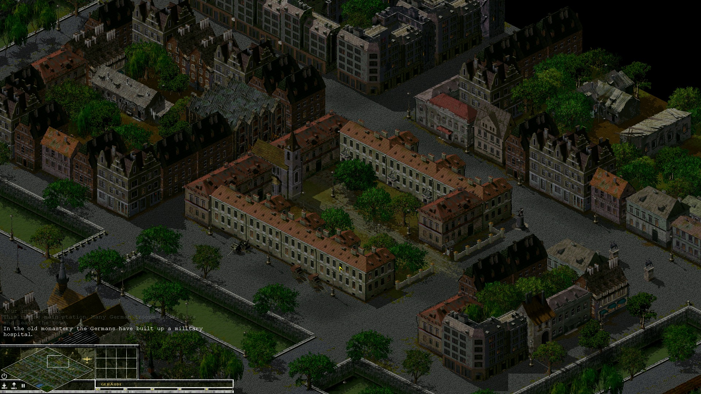
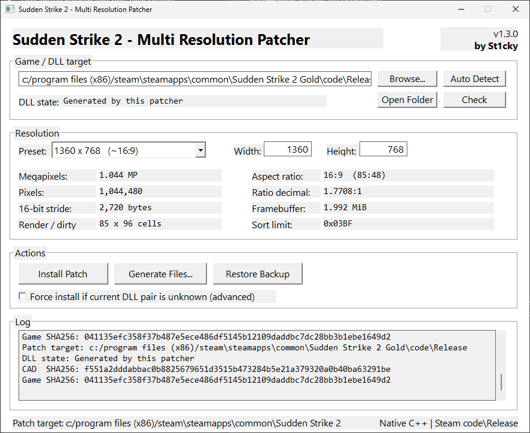

# Sudden Strike 2 — Multi Resolution Patcher

A native Windows resolution patcher for **Sudden Strike 2 Gold**, designed to make widescreen and custom resolutions practical without manually editing game DLLs.

The patcher automatically detects the Steam installation, validates the relevant game files, creates a backup before the first install, and applies the selected resolution through a simple GUI.

> **Binary release repository:** source code is intentionally not published here.  
> Download the compiled application from the **[GitHub Releases](../../releases/latest)** page.

## Screenshot

### 1920×1080 gameplay


### Patcher-GUI


## Features

- Native **C++ / Win32** application
- Single portable `SS2MultiResPatcher.exe`
- No Python, Qt, or external runtime files required
- Automatic Steam and SteamLibrary detection
- Steam runtime folder detection:
  `Sudden Strike 2 Gold\code\Release`
- Manual path selection for alternate installations
- Resolution presets and custom width/height
- Live display of:
  - megapixels
  - aspect ratio
  - decimal ratio
  - total pixel count
  - framebuffer information
- Automatic DLL compatibility/state check
- Automatic first backup
- One-click restore
- Generate patched files without installing them
- Administrator manifest for protected Steam installations
- `by St1cky`

## Supported resolutions

The current release supports resolutions up to:

**1920 × 1080**

The width must currently be an even number.

Included presets:

| Resolution | Aspect |
|---:|:---|
| 640×480 | 4:3 |
| 800×600 | 4:3 |
| 1024×768 | 4:3 |
| 1152×648 | 16:9 |
| 1280×720 | 16:9 |
| 1280×800 | 16:10 |
| 1280×960 | 4:3 |
| 1280×1024 | 5:4 |
| 1360×768 | ~16:9 |
| 1366×768 | ~16:9 |
| 1440×900 | 16:10 |
| 1600×900 | 16:9 |
| 1680×1050 | 16:10 |
| **1920×1080** | **16:9 — confirmed reference** |

Custom resolutions inside the supported range can also be entered manually.

## Installation

1. Open **[Releases](../../releases/latest)**.
2. Download `SS2MultiResPatcher.exe`.
3. Run the executable.
4. The patcher should automatically detect the Steam installation.
5. Verify that the displayed patch target is the expected folder.
6. Select a resolution.
7. Click **Install Patch**.
8. Start Sudden Strike 2 normally through Steam.

For a standard Steam installation, the expected runtime target is:

```text
C:\Program Files (x86)\Steam\steamapps\common\Sudden Strike 2 Gold\code\Release
```

The patcher modifies only:

```text
n2Cad1024.dll
n2Game_Dll.dll
```

It does **not** replace the Steam launcher or the other game DLLs.

More detail: [Installation guide](docs/INSTALLATION.md)

## Backup and restore

On the first install, the patcher creates:

```text
SS2_MultiRes_Backup
```

Use **Restore Backup** in the GUI to return to the backed-up DLL pair.

Steam's **Verify integrity of game files** can also restore original game files if required. You will need to run the patcher again afterward.

## Steam compatibility

The patcher prioritizes the game's normal Steam runtime directory under `code\Release`.

This is intentional so the normal Steam launch path and Steam integration remain in use.

If your installation is different, use **Browse** and select either:

- the folder containing `n2Cad1024.dll` and `n2Game_Dll.dll`, or
- the main Sudden Strike 2 Gold folder; the patcher will then check `code\Release`.

## File validation

The patcher checks the current DLL pair before modifying anything and identifies supported/original, confirmed, generated, or unknown states.

Unknown or externally modified files are not silently treated as clean originals.

## Windows / antivirus notice

The tool modifies game DLLs and requests administrator rights when required by the install location. Because it is an unsigned community patcher, Windows SmartScreen or antivirus software may occasionally warn about the executable.

Download releases only from this repository and verify the SHA-256 checksum published with each release.

## Troubleshooting

See [Troubleshooting](docs/TROUBLESHOOTING.md).

## Source code

This repository is intentionally **binary-release only**.

The patching implementation is compiled into the native application and the source code is not distributed in this repository.

No original Sudden Strike 2 game binaries are included in this repository or its documentation.

## Disclaimer

This is an unofficial community project and is not affiliated with or endorsed by the developers, publishers, Valve, or Steam.

Sudden Strike and all related trademarks and game assets belong to their respective owners.

Use the patcher at your own risk and keep backups.

---

**Sudden Strike 2 — Multi Resolution Patcher**  
**by St1cky**
